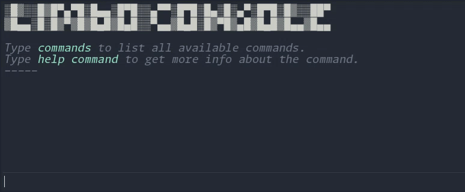

---



[](https://github.com/limbonaut/limbo_console/blob/master/LICENSE.md)

This is a **Limbo Console** Fork, support the original [**here**](https://github.com/limbonaut/limbo_console/tree/master)

Notable **differences** from original, virtualized console log, nested command categories, added scroll modifiers, command line argument support, & re-themed visuals

A simple and easy-to-use in-game dev console with a command interpreter for Godot Engine 4.

It supports auto-completion with `TAB` for commands and history, auto-correction, inline hints and highlighting, command help text generation, argument parsing for basic types, aliases, custom theming, and more.

This plugin is currently in development, so expect breaking changes.

## How to use

> 🛈 TinyConsole can be added as a Git submodule

Place the source code in the `res://addons/tiny_console/` directory, and enable this plugin in the project settings, then reload the project. Toggle the console with the `GRAVE ACCENT` key (aka backtick - the key to the left of the `1` key). This can be changed in the Input Map tab in the project settings.

Adding a new command is quite simple:

```gdscript
func _ready() -> void:
    TinyConsole.register_command(multiply)

func multiply(a: float, b: float) -> void:
    TinyConsole.info("a * b: " + str(a * b))
```

The example above adds a command that multiplies two numbers and prints the result (type `multiply 2 4`). Additionally, you can specify a name, description, and a category:

```gdscript
TinyConsole.register_command(multiply, "multiply", "multiply two numbers", "Math")
```

You can add a command as a subcommand of another command:

```gdscript
# Register `multiply` as a subcommand under a new `math` command.
TinyConsole.register_command(multiply, "math multiply", "Multiply two numbers")
```

Now, you can enter `math multiply 2 4` in the console. By the way, the parent command doesn't have to exist.

Several basic types are supported for command arguments, such as `bool`, `int`, `float`, `String` and `Vector{2,3,4}` types. To enter a `Vector2` argument, enclose its components in parentheses, like this: `(1 2)`. String arguments can also be enclosed in double quotation marks `"`.

Autocompletion works for both command names and history. It can also be implemented for specific command arguments, as shown in the following example:
```gdscript
TinyConsole.register_command(teleport, "teleport", "teleport to site on this level", "Gameplay")
TinyConsole.add_argument_autocomplete_source("teleport", 1,
        func(): return ["entrance", "caves", "boss"]
)
```
For a dynamically generated list of autocomplete values, the code could look like this:
```gdscript
TinyConsole.add_argument_autocomplete_source("teleport", 1,
        func(): return get_tree().get_nodes_in_group("teleportation_site").map(
                func(node): return node.name)
)
```

### Methods and properties

Some notable methods and properties:

- TinyConsole.enabled
- TinyConsole.register_command(callable, command_name, description, category)
- TinyConsole.unregister_command(callable_or_command_name)
- TinyConsole.add_alias(alias_name, command_name)
- TinyConsole.info(text_line)
- TinyConsole.error(text_line)
- TinyConsole.warning(text_line)
- TinyConsole.toggle_console()
- TinyConsole.add_argument_autocomplete_source(command_name, argument, callable)
- TinyConsole.execute_script(path, silent)

This is not a complete list. For the rest, check out `tiny_console.gd`.

### Keyboard Shortcuts
- `Tilde` *(aka '**~**' the key to the left of the `1` key)* — Toggle the console.
- `Enter` — Run entered command.
- `Tab` — Autocomplete command entry or cycle through autocomplete suggestions.
- `Shift + Tab` — Cycle through autocomplete suggestions in reverse.
- `Right` *(when cursor is at the end of command entry)* — Autocomplete according to inline hint (doesn't cycle like `Tab`).
- `Up/Down` — Cycle through command history, replacing contents of command entry.
- `Ctrl + R` — Toggle the history search interface (similar to [fzf](https://github.com/junegunn/fzf)).
- `Ctrl + C` *(when no text selected)* — Clear the command entry.

### Mouse Shortcuts
- `Scroll Wheel` — Scroll through history
- `Scroll Wheel + Shift` — Fast scroll
- `Scroll Wheel + Ctrl` — Speed scroll
- `Scroll Wheel + Shift + Ctrl` — Super speed scroll

### Command Line Arguments
- `--enableConsole` — Force enables console, even if `disabled-in-release` (Can be disabled in config)

### Configuration
Options can be modified in the project-specific configuration file located at `res://addons/tiny_console.cfg`. This file is stored outside the plugin's directory to support adding the plugin as a Git submodule.

TinyConsole also supports UI theming. Simply duplicate the `default_theme.tres` file and rename it to `tiny_console_theme.tres`. The file path is important - it should be located at `res://addons/tiny_console_theme.tres`. You can change this location in the config file.
Open the theme resource in Godot to customize it for your game. Console text colors can be adjusted in the `ConsoleColors` category.

### Scripting
You can execute simple scripts containing a sequence of commands:
```shell
exec lcs/my_script.lcs
```

Simple rules:
- Commands must be provided in the same syntax as in the prompt, with each command on a separate line.
- The script must exist at the specified path, either in the `res://` or `user://` directory.
- The script must have the `.lcs` extension, but when running the `exec` command, you can omit the extension in the command line.
- A line that starts with a '#' is treated as a comment and is not executed as part of the script.

You can have a script execute automatically every time the game starts. There is a special script called `user://autoexec.lcs` that runs each time the game starts. This can be customized in the configuration file.
